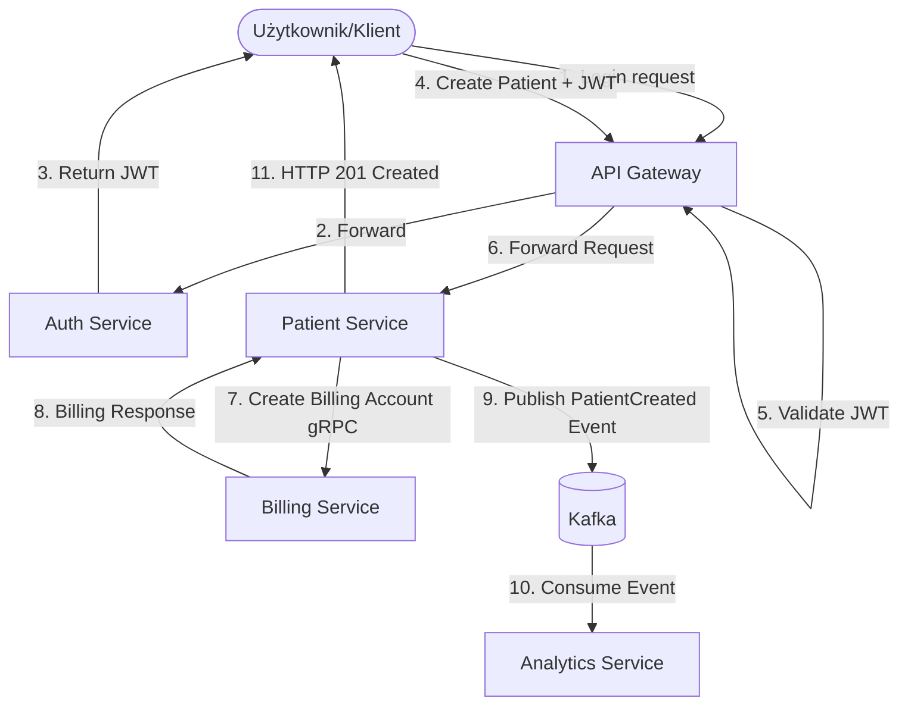
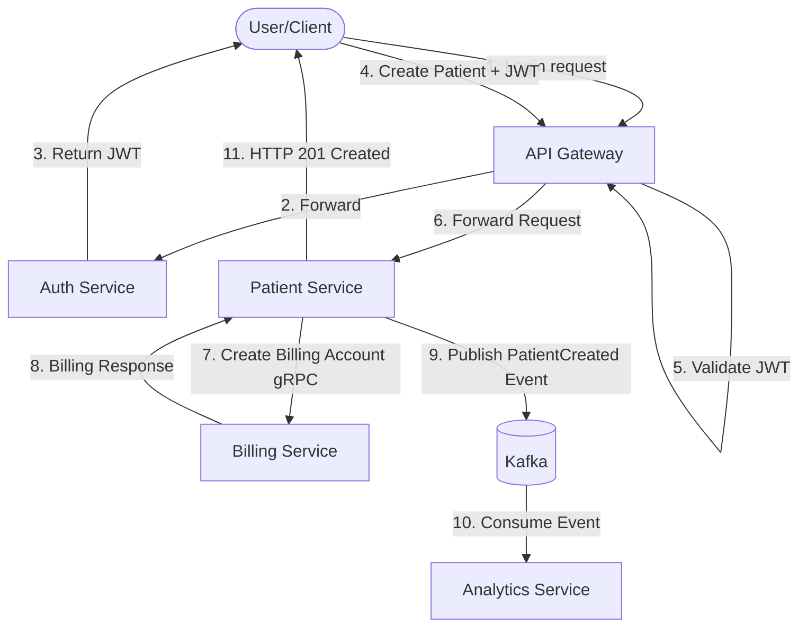

# Patient Management System

[PL] [Polski](#polski) | [EN] [English](#english)

---

## Wersja Polska

Kompleksowy system zarządzania pacjentami oparty na architekturze mikroserwisowej, wykorzystujący nowoczesne technologie komunikacji i bezpieczeństwa.

### 🚀 Stack Technologiczny

*   **Język:** Java 21
*   **Framework:** Spring Boot 3.4+
*   **API Gateway:** Spring Cloud Gateway
*   **Bezpieczeństwo:** Spring Security, JWT (JSON Web Token)
*   **Komunikacja Między Serwisami:**
    *   **gRPC:** Synchronizowana, wysokowydajna komunikacja (np. Patient -> Billing)
    *   **Apache Kafka:** Asynchroniczne przesyłanie zdarzeń (np. Patient -> Analytics)
*   **Bazy Danych:** PostgreSQL (Produkcja), H2 (Development/Testy), Spring Data JPA
*   **Dokumentacja:** OpenAPI / Swagger (SpringDoc)
*   **Budowanie projektu:** Maven

### 🏗️ Architektura Modułów

System składa się z następujących mikroserwisów:

1.  **`api-gateway` (Port: 4004):** Główny punkt wejściowy systemu. Odpowiada za routing żądań oraz walidację tokenów JWT dla chronionych zasobów.
2.  **`auth-service` (Port: 4005):** Odpowiada za rejestrację, logowanie użytkowników oraz generowanie i walidację tokenów JWT.
3.  **`patient-service` (Port: 4000):** Rdzeń systemu zarządzający danymi pacjentów. Przy tworzeniu pacjenta komunikuje się z `billing-service` (via gRPC) oraz publikuje zdarzenia do systemu analitycznego (via Kafka).
4.  **`billing-service`:** Obsługuje procesy rozliczeniowe. Udostępnia interfejs gRPC do tworzenia kont rozliczeniowych dla nowych pacjentów.
5.  **`analytics-service`:** Konsumuje zdarzenia z Kafki i przetwarza je w celach analitycznych (np. śledzenie nowych rejestracji).

### 🔄 Action Flow (Diagram Przepływu)

Poniższy diagram przedstawia standardowy proces rejestracji nowego pacjenta w systemie:

### 🛠️ Uruchomienie

Projekt jest wielomodułowym projektem Maven. Każdy serwis może być uruchomiony niezależnie jako aplikacja Spring Boot.

Wymagane do działania:
*   Java 21
*   Instancja PostgreSQL
*   Instancja Apache Kafka
*   Opcjonalnie: Docker do konteneryzacji (jeśli przygotowano Dockerfile)

### 📝 Dokumentacja API

Dokumentacja Swagger/OpenAPI jest dostępna pod adresami (po uruchomieniu bramy):
*   Auth Service: `http://localhost:4004/api-docs/auth`
*   Patient Service: `http://localhost:4004/api-docs/patients`

---

## English Version

A comprehensive patient management system based on microservices architecture, utilizing modern communication and security technologies.

### 🚀 Tech Stack

*   **Language:** Java 21
*   **Framework:** Spring Boot 3.4+
*   **API Gateway:** Spring Cloud Gateway
*   **Security:** Spring Security, JWT (JSON Web Token)
*   **Inter-service Communication:**
    *   **gRPC:** Synchronous, high-performance communication (e.g., Patient -> Billing)
    *   **Apache Kafka:** Asynchronous event streaming (e.g., Patient -> Analytics)
*   **Databases:** PostgreSQL (Production), H2 (Development/Testing), Spring Data JPA
*   **Documentation:** OpenAPI / Swagger (SpringDoc)
*   **Build Tool:** Maven

### 🏗️ Module Architecture

The system consists of the following microservices:

1.  **`api-gateway` (Port: 4004):** The main entry point of the system. Responsible for request routing and JWT token validation for protected resources.
2.  **`auth-service` (Port: 4005):** Responsible for user registration, login, and generating/validating JWT tokens.
3.  **`patient-service` (Port: 4000):** The core of the system managing patient data. When creating a patient, it communicates with `billing-service` (via gRPC) and publishes events to the analytics system (via Kafka).
4.  **`billing-service`:** Handles billing processes. Provides a gRPC interface to create billing accounts for new patients.
5.  **`analytics-service`:** Consumes events from Kafka and processes them for analytical purposes (e.g., tracking new registrations).

### 🔄 Action Flow

The following diagram illustrates the standard process of registering a new patient in the system:

### 🛠️ Getting Started

The project is a multi-module Maven project. Each service can be run independently as a Spring Boot application.

Requirements:
*   Java 21
*   PostgreSQL instance
*   Apache Kafka instance
*   Optional: Docker for containerization (if Dockerfile is provided)

### 📝 API Documentation

Swagger/OpenAPI documentation is available at the following addresses (after starting the gateway):
*   Auth Service: `http://localhost:4004/api-docs/auth`
*   Patient Service: `http://localhost:4004/api-docs/patients`
